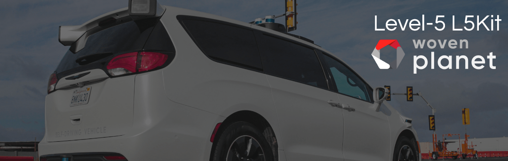

.. _index:

Welcome to L5Kit !
===============================================================================
L5Kit is a Python library with functionality for the development and training of *learned prediction, planning and simulation* models for autonomous driving applications.

Introduction
------------

This repository and the associated datasets constitute a framework for developing learning-based solutions to prediction, planning and simulation problems in self-driving. State-of-the-art solutions to these problems still require significant amounts of hand-engineering and unlike, for example, perception systems, have not benefited much from deep learning and the vast amount of driving data available.

The purpose of this framework is to enable engineers and researchers to experiment with data-driven approaches to planning and simulation problems using real world driving data and contribute to state-of-the-art solutions.

.. image:: images/pipeline.png
   :width: 800
   :alt: Modern AV pipeline

You can use this framework to build systems which:

* Turn prediction, planning and simulation problems into data problems and train them on real data.
* Use neural networks to model key components of the Autonomous Vehicle (AV) stack.
* Use historical observations to predict future movement of cars around an AV.
* Plan behavior of an AV in order to imitate human driving.
* Study the improvement in performance of these systems as the amount of data increases.

This software is developed by Lyft Level 5 self-driving division and is :ref:`open to external contributors <contribute>`.

Video Tutorial
--------------

Here is a short video tour introducing the L5Kit and the functionalities of the library.

.. raw:: html

   <iframe width="560" height="315" src="https://www.youtube.com/embed/1cfXBS0i92Q" title="YouTube video player" frameborder="0" allow="accelerometer; autoplay; clipboard-write; encrypted-media; gyroscope; picture-in-picture" allowfullscreen></iframe>

News
-------------------------------------------------------------------------------

* **10-06-2021**: We've just released a series of notebooks to train and evaluate the model introduced in our paper `Urban Driver: Learning to Drive from Real-world Demonstrations Using Policy Gradients <https://arxiv.org/abs/2109.13333>`_ !
* **08-20-2021**: We've just released a new notebook tutorial describing our :ref:`L5Kit gym-compatible environment <reinforcement>`!
* **04-16-2021**: We've just released a new notebook tutorial for the :ref:`ML simulation task <simulation>`!
* **12-03-2020**: We've just released a series of notebooks to train and evaluate an :ref:`ML planning model <planning>`. We've also included pre-trained models!
* **11-26-2020**: `2020 Kaggle Lyft Motion Prediction for Autonomous Vehicles Competition <https://www.kaggle.com/c/lyft-motion-prediction-autonomous-vehicles/overview>`_ ended. We had more than 900 teams taking part in it!
* **11-16-2020**: `Dataset paper <https://arxiv.org/abs/2006.14480>`_ presented at CoRL 2020
* **09-29-2020**: L5Kit v1.0.1 released
* **08-25-2020**: `2020 Kaggle Lyft Motion Prediction for Autonomous Vehicles Competition <https://www.kaggle.com/c/lyft-motion-prediction-autonomous-vehicles/overview>`_ started
* **08-24-2020**: L5Kit v1.0.6 and Dataset v1.1 (includes traffic light support) released!

Table of Contents
===============================================================================

.. toctree::
   :maxdepth: 2

   gettingstarted

.. toctree::
   :maxdepth: 3

   tutorials

.. toctree::
   :maxdepth: 1

   additional_resources_index

.. toctree::
   :maxdepth: 1

   api_reference

.. toctree::
   :maxdepth: 1

   how_to_contribute

.. toctree::
    :maxdepth: 1

    license

.. toctree::
    :maxdepth: 1

    credits

.. toctree::
   :maxdepth: 2

   changelog

.. image:: images/L5logo.png
   :width: 200

Contact
===============================================================================
If you find problem or have questions about L5Kit please feel free to create `github issue <https://github.com/woven-planet/l5kit/issues>`_ !
