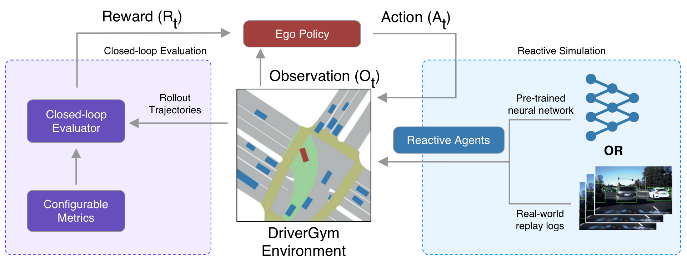

.. _reinforcement:

Reinforcement Learning
======================

Our paper `DriverGym: Democratising Reinforcement Learning for Autonomous Driving <https://arxiv.org/abs/2111.06889>`_
has been accepted at `ML4AD Workshop, NeurIPS 2021 <https://ml4ad.github.io/>`_.

In this series of notebooks you will train and evaluate reinforcement learning policies in DriverGym.

**Before starting, please download the Woven by Toyota Prediction Dataset 2020 and follow the instructions to correctly organise it.**

* `Woven by Toyota Prediction Dataset 2020 <https://woven.toyota/en/prediction-dataset>`_
* `Instructions <https://github.com/woven-planet/l5kit#download-the-datasets>`_

DriverGym Environment
---------------------

From the paper:

```
DriverGym is an open-source gym environment that enables training RL driving policies on
real-world data. The RL policy can access rich semantic maps to control the ego. Other agents 
can either be simulated from the data logs or controlled using a dedicated policy pre-trained
on real-world data. We provide an extensible evaluation system with easily configurable
metrics to evaluate the idiosyncrasies of the trained policies.
```




Notebook Tutorial
-----------------

We provide two notebooks introducing our DriverGym environment.

You can test your RL policy in DriverGym using our `gym notebook <https://github.com/woven-planet/l5kit/blob/master/examples/RL/notebooks/gym_environment.ipynb>`_ \

.. image:: https://colab.research.google.com/assets/colab-badge.svg
   :target: https://colab.research.google.com/github/woven-planet/l5kit/blob/master/examples/RL/notebooks/gym_environment.ipynb
   :alt: Open In Colab


You can also train and test a PPO policy in DriverGym using our `PPO notebook <https://github.com/woven-planet/l5kit/blob/master/examples/RL/notebooks/ppo_policy_training.ipynb>`_ \

.. image:: https://colab.research.google.com/assets/colab-badge.svg
   :target: https://colab.research.google.com/github/woven-planet/l5kit/blob/master/examples/RL/notebooks/ppo_policy_training.ipynb
   :alt: Open In Colab
