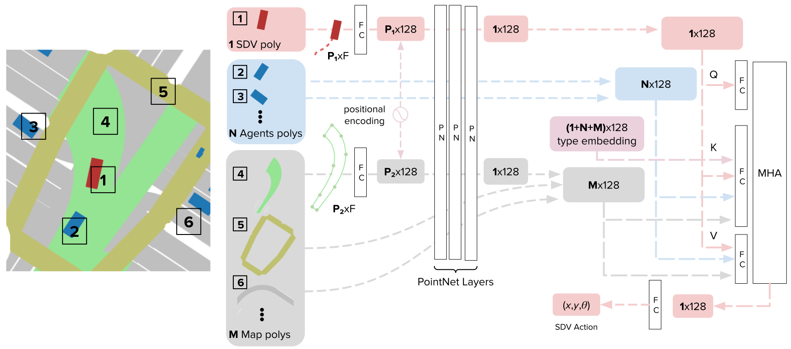

.. _urbandriver:

Urban Driver
========

Our paper `Urban Driver: Learning to Drive from Real-world Demonstrations Using Policy Gradients <https://openreview.net/pdf?id=ibktAcINCaj>`_
has been accepted for publication at `CoRL 2021 <https://www.robot-learning.org/>`_.

In it, we introduce a Deep Neural Network called Urban Driver;

From the paper:

```
We use a graph neural network for parametrizing our policy.
It combines a PointNet-like architecture for local inputs processing followed by an attention mechanism for global reasoning.
In contrast to VectorNet, we use points instead of vectors.
Given the set of points corresponding to each input element, we employ 3 PointNet layers to calculate a 128-dimensional feature descriptor.
Subsequently, a single layer of scaled dot-product attention performs global feature aggregation, yielding the predicted trajectory [...]
In total, our model contains around 3.5 million trainable parameters, and training takes 30h on 32 Tesla V100 GPUs.
```




In this series of notebooks you will train and evaluate Urban Driver.

**Before starting, please download the Lyft L5 Prediction Dataset 2020 and follow the instructions to correctly organise it.**

* `Lyft L5 Prediction Dataset 2020 <https://self-driving.lyft.com/level5/prediction/>`_
* `Instructions <https://github.com/lyft/l5kit#download-the-datasets>`_

We trained Urban Driver in a distributed system using multiple GPUs. We understand that not everybody has access to this kind of resources.
For this reason, we provide trained models you can experiment with in our evaluations notebooks,
without requiring to train one yourself.

Notebook Tutorial
-----------------

We provide 2 notebooks.

Training Notebook
~~~~~~~~~~~~~~~~~

You can train your own Urban Driver using our `training notebook <https://github.com/lyft/l5kit/blob/master/examples/urban_driver/train.ipynb>`_

.. image:: https://colab.research.google.com/assets/colab-badge.svg
   :target: https://colab.research.google.com/github/lyft/l5kit/blob/master/examples/urban_driver/train.ipynb
   :alt: Open In Colab

Pre-Trained Models
++++++++++++++++++

We provide a collection of pre-trained models you can experiment with and use in your own experiments.
Scroll to the end of the notebook to download them.


Closed-Loop Evaluation Notebook
~~~~~~~~~~~~~~~~~~~~~~~~~~~~~

You can evaluate Urban Planner in closed-loop setting using our `closed-loop evaluation notebook <https://github.com/lyft/l5kit/blob/master/examples/urban_driver/closed_loop_test.ipynb>`_

.. image:: https://colab.research.google.com/assets/colab-badge.svg
   :target: https://colab.research.google.com/github/lyft/l5kit/blob/master/examples/urban_driver/closed_loop_test.ipynb
   :alt: Open In Colab


Video Tutorial
--------------

As part of our submissions to CoRL 2021 we have recorded a short presentation video, which includes some visual results of Urban Driver in action.

TODO: link video here
